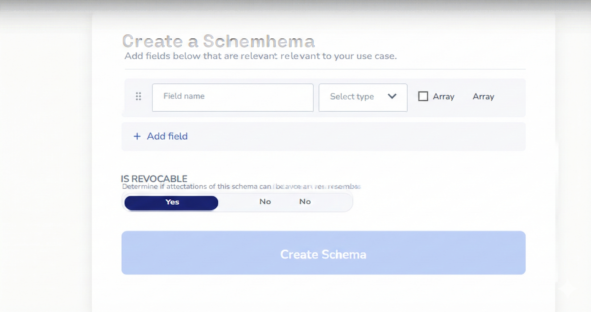

# Based Endorsements

A Farcaster Frame application built on Base blockchain that allows users to endorse builders with on-chain attestations via EAS (Ethereum Attestation Service).

## Features

- 🎯 **Basename Resolution**: Automatically resolves Basenames (e.g., `jesse.base.eth`) to Ethereum addresses
- ⛓️ **On-chain Attestations**: Creates permanent endorsement records using EAS on Base
- 🎨 **Beautiful UI**: Gradient-based Frame design with intuitive multi-step flow
- 🚀 **Skills**: Endorse builders as Shippers, Designers, or Big Brains
- 💎 **Free to Use**: No transaction fees for creating endorsements

## Tech Stack

- **Framework**: Next.js 14 with App Router
- **Frame**: Frog.fm for Farcaster Frame functionality
- **Blockchain**: Base Mainnet
- **Libraries**: 
  - `viem` for blockchain interactions
  - `@coinbase/onchainkit` for Basename resolution
  - EAS for attestations

## Getting Started

### Prerequisites

- Node.js 18+ and npm
- An Ethereum wallet (for signing transactions)

### Installation

```bash
# Install dependencies
npm install

# Run development server
npm run dev
```

The Frame will be available at `http://localhost:3000/api`

### Environment Variables

Copy `.env.example` to `.env.local`:

```bash
NEXT_PUBLIC_BASE_RPC_URL=https://mainnet.base.org
```

For enhanced performance, you can add:
- `NEXT_PUBLIC_ALCHEMY_API_KEY`
- `NEXT_PUBLIC_INFURA_API_KEY`

## How It Works

### User Flow

1. **Input Screen**: User enters a Basename (e.g., "jesse")
2. **Skill Selection**: Choose the skill to endorse (Shipper/Designer/Big Brain)
3. **Confirmation**: View resolved address and confirm endorsement
4. **Transaction**: Create EAS attestation on-chain
5. **Success**: View confirmation with link to EASScan

### On-chain Components

**EAS Contract**: `0x4200000000000000000000000000000000000021` (Base)  
**Schema UID**: `0xa1380ad137f38b38f91036b612e299ad6b8ebcc86713ff21e9083e1a82add984`  
**Schema**: `string skill, string comment`

## Testing the Frame

1. **Local Testing**: Run `npm run dev` and navigate to `/api`
2. **Frame Validator**: Use [Farcaster Frame Validator](https://warpcast.com/~/developers/frames)
3. **Deploy**: Deploy to Vercel and share the Frame URL in Warpcast

## Deployment

### Vercel (Recommended)

```bash
npm run build
vercel --prod
```

### Other Platforms

The app can be deployed to any Node.js hosting platform that supports Next.js 14.

## Project Structure

```
based-endorsements/
├── app/
│   ├── api/
│   │   └── [[...routes]]/
│   │       └── route.tsx       # Main Frame handler
│   ├── layout.tsx              # Root layout
│   ├── page.tsx                # Homepage
│   └── globals.css             # Global styles
├── lib/
│   ├── basename.ts             # Basename resolution utilities
│   ├── eas.ts                  # EAS attestation helpers
│   └── constants.ts            # Configuration constants
└── package.json
```

## Development

### Key Files

- **`app/api/[[...routes]]/route.tsx`**: Main Frame logic with all screens
- **`lib/basename.ts`**: Basename resolution using viem
- **`lib/eas.ts`**: EAS attestation building and ABI
- **`lib/constants.ts`**: Base chain config and constants

### Customization

- **Skills**: Edit `SKILL_OPTIONS` in `lib/constants.ts`
- **Schema**: Update `ENDORSEMENT_SCHEMA_UID` for custom schemas
- **Design**: Update gradient colors and styles in `route.tsx`

## Contributing

Feel free to submit issues and enhancement requests!

## License

MIT

## Resources

- [Frog Documentation](https://frog.fm)
- [Base Documentation](https://docs.base.org)
- [EAS Documentation](https://docs.attest.sh)
- [OnchainKit](https://onchainkit.xyz)
- [Farcaster Frames](https://docs.farcaster.xyz/reference/frames/spec)
